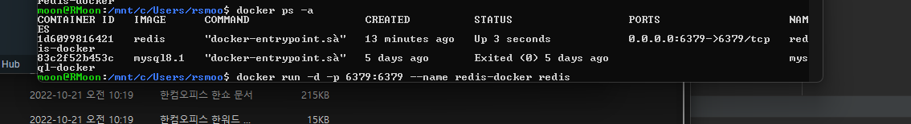
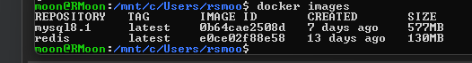

```bash
moon@RMoon:/mnt/c/Users/rsmoo$ docker ps -a
CONTAINER ID   IMAGE      COMMAND                  CREATED          STATUS                  PORTS                    NAMES
1d6099816421   redis      "docker-entrypoint.s…"   13 minutes ago   Up 3 seconds            0.0.0.0:6379->6379/tcp   redis-docker
83c2f52b453c   mysql8.1   "docker-entrypoint.s…"   5 days ago       Exited (0) 5 days ago                            mysql-docker
moon@RMoon:/mnt/c/Users/rsmoo$ docker run -d -p 6379:6379 --name redis-docker redis
```